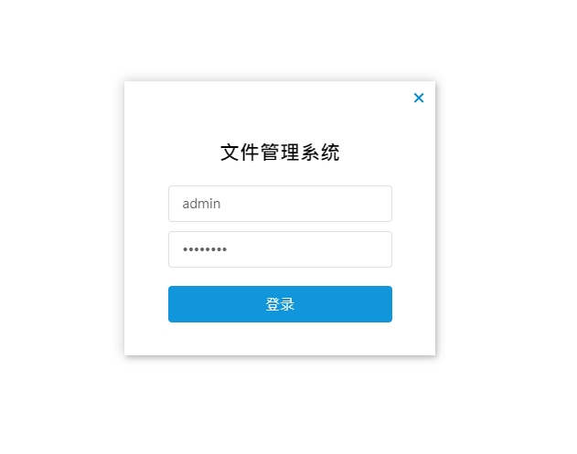
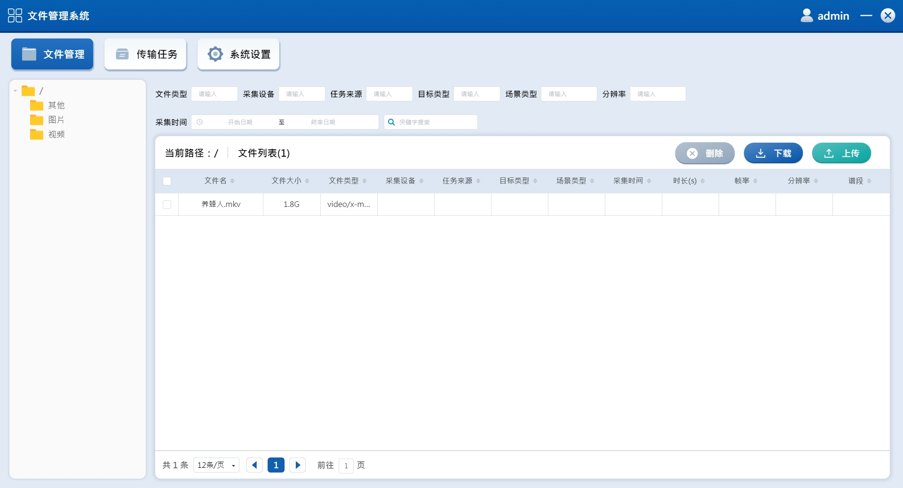
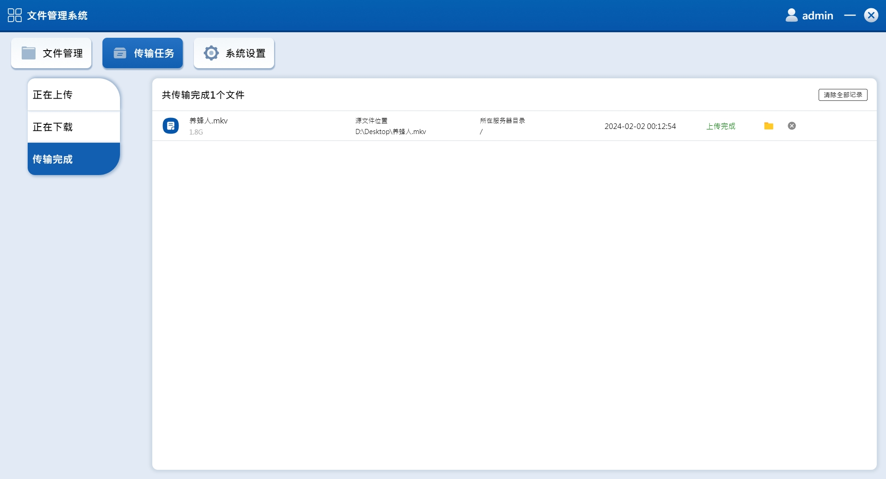
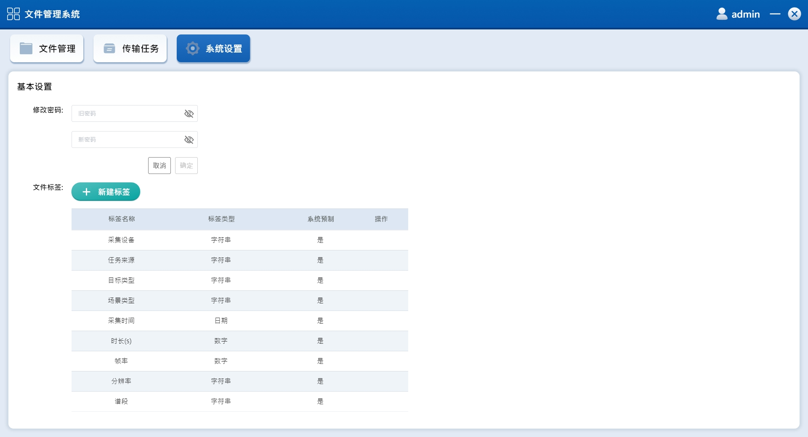

## 项目介绍

`file-manage`是一个基于`electron-vue`开发的文件管理客户端，主要功能如下：

- 支持文件上传、断点续传、急速秒传
- 支持文件下载、断点下载
- 文件数据的列表筛选、排序、分页展示
- 可为上传的文件设置自定义标签
- 支持已上传文件视频的预览
- 支持已对上传视频文件进行剪裁后导出（修改分辨率、帧率、剪裁起止时间）
- 支持已上传图片文件的预览

## 项目截图






## 技术选型

| 技术              | 说明                  | 官网                                                         |
| ----------------- | --------------------- | ------------------------------------------------------------ |
| Electron          | 客户端框架             | [https://www.electronjs.org/zh/](https://www.electronjs.org/zh/) |
| Electron-vue      | 客户端框架             | [https://simulatedgreg.gitbooks.io/electron-vue/content/cn/](https://simulatedgreg.gitbooks.io/electron-vue/content/cn/) |
| Postgresql        | 数据库                 | [https://www.postgresql.org/](https://www.postgresql.org/) |
| Minio             | 对象存储               | [https://min.io/](https://min.io/) |
| Vue               | 前端框架               | [https://vuejs.org/](https://vuejs.org/) |
| Vue-router        | 路由框架               | [https://router.vuejs.org/](https://router.vuejs.org/) |
| Vuex              | 全局状态管理框架        | [https://vuex.vuejs.org/](https://vuex.vuejs.org/) |
| Element           | 前端UI框架             | [https://element.eleme.io/](https://element.eleme.io/) |
| PyQT5             | 客户端框架              | [https://doc.qt.io/qtforpython-6/](https://doc.qt.io/qtforpython-6/) |
| ffmpeg            | 多媒体处理工具          | [https://ffmpeg.org/](https://ffmpeg.org/) |

## 项目布局

``` lua
src
├── main -- electron入口文件
├── renderer -- vue主目录
├── components -- 通用组件封装
    ├── assets -- 图片文件
    ├── components -- 各vue页面
        ├── common -- 通用组件
        ├── fileList -- 文件管理页面
        ├── login -- 登录页
        ├── syssetting -- 系统设置页
        ├── transfer -- 传输任务页
        └── index.vue -- 主路由页
    ├── config -- 全局配置
    ├── db -- postgressql、minio模块
    ├── http -- http通信模块
    ├── router -- vue-router路由配置
    ├── store -- vuex的状态管理
    └── util -- 工具类
static -- 静态资源
pyScript -- 视频编辑模块
```

## 部署
##### 1.部署postgresql和minio
- 方式一：安装Docker后根目录运行docker-compose up -d命令使用docker-compose.yml文件部署postgresql和minio
- 方式二：直接部署postgresql和minio，具体安装步骤参考postgresql和minio官网
- 方式三：修改static/config.json文件中postgresql和minio的配置连接外部数据库

##### 2.设置依赖下载地址
- 安装nodejs 14.19.0
- npm config set metrics-registry=https://mirrors.huaweicloud.com/repository/npm/
- npm config set chromedriver_cdnurl=https://mirrors.huaweicloud.com/chromedriver
- npm config set electron_mirror=https://mirrors.huaweicloud.com/electron/
- npm config set registry=https://mirrors.huaweicloud.com/repository/npm/

##### 3.修改配置
修改static/config.json文件中的配置

##### 4.下载ffmpeg库文件
- 由于github上传文件大小的限制，需要自己下载ffmpeg.exe和ffprobe.exe到static目录
- 下载地址：[https://github.com/BtbN/FFmpeg-Builds/releases](https://github.com/BtbN/FFmpeg-Builds/releases)

##### 5.本地运行
```
npm install
npm run dev
```

##### 6.打包
```
npm run build:dir
运行build/win-unpacked文件夹内的file-manage.exe
```

## 其他
1.  最大上传的文件大小取决于minio的MINIO_API_REQUESTS_MAX，合并文件时并发请求数接近chunk数量，文件越大chunk数量越大，对并发请求数量要求越高
2.  minio的bucket的Access Policy必须设置为public，否则会出现无法读取视频duration的情况
3.  视频编辑器的源代码位于/pyScript目录（基于pyQT5）
4.  第一次运行软件会自动创建postgresql的database和schema，同时创建minio的bucket
5.  当static/config.json文件中的migrate_db设置为true时，软件会从static/migrate文件夹中寻找最新版本的sql文件进行执行，当软件执行完migrate动作后会自动将migrate_db修改为false并保存
6.  ctrl+P可唤出控制台
7.  如何更换icon
    - 修改package.json
    ```
      "win": {
        "icon": "build/icons/icon.ico"
      }
      为
      "win": {
        "icon": "build/icons/icon.png"
      }
    ```
    - 将下载好的icon.png放置build/icons文件夹，大小最低要求256*256
    - 执行npm run build:dir
    - 将生成的build/icon/.icon-ico/文件夹内的icon.ico拷贝置build/icons文件夹
    - 将package.json中的
    ```
      "win": {
        "icon": "build/icons/icon.png"
      }修改回去
    ```
